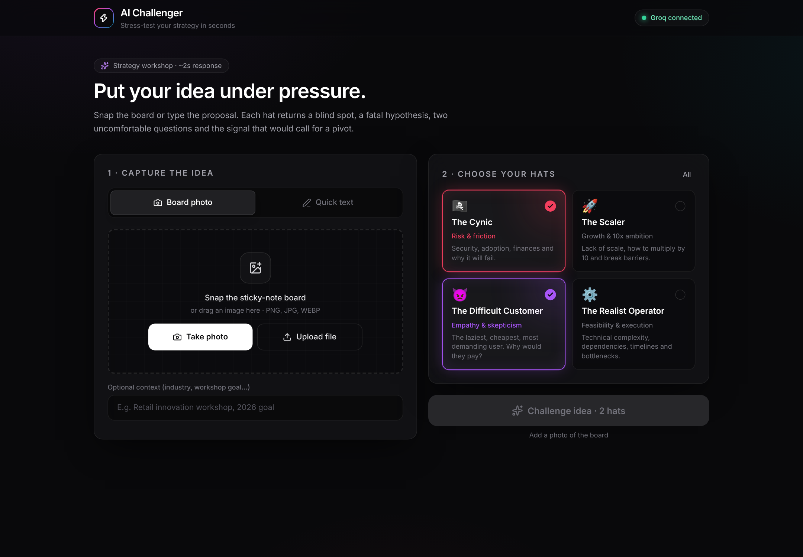
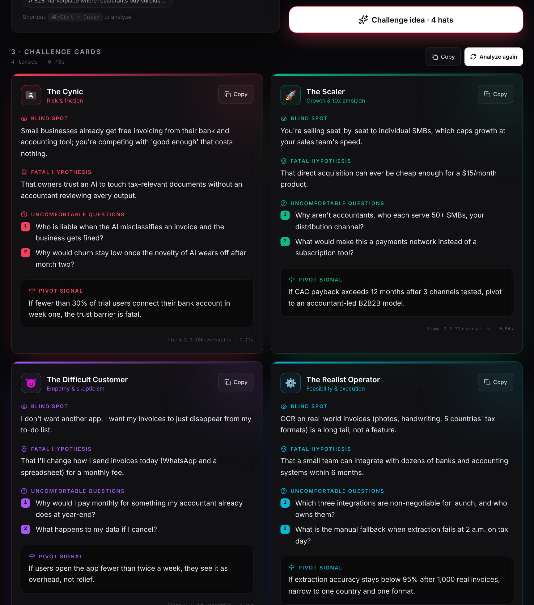
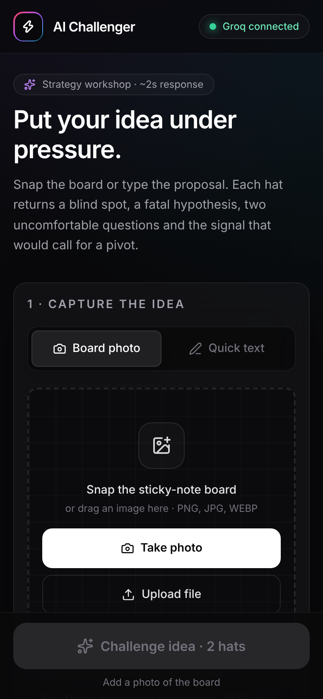
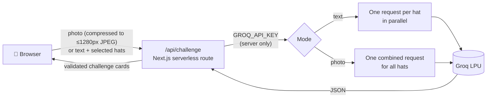

<div align="center">


# AI Challenger

**Stress-test your strategy in seconds.**

Snap a photo of a sticky-note board — or type an idea — and get Blind Spots, Fatal Hypotheses and Uncomfortable Questions from four strategic "Thinking Hats", powered by [Groq](https://groq.com).

[**🚀 Live demo → ai-challenger.vercel.app**](https://ai-challenger.vercel.app)

[](https://github.com/FelipeMachado25/AI-Challenger/actions/workflows/ci.yml)


[](LICENSE)

</div>

<p align="center">
  
</p>

---

## Table of contents

- [What it does](#-what-it-does)
- [The 4 hats](#-the-4-hats)
- [Screenshots](#-screenshots)
- [How it works](#-how-it-works)
- [Quick start](#-quick-start)
- [Deploy to Vercel](#-deploy-to-vercel)
- [Configuration](#-configuration)
- [Security](#-security)
- [API reference](#-api-reference)
- [Project structure](#-project-structure)
- [Troubleshooting](#-troubleshooting)
- [Contributing](#-contributing)
- [License](#-license)

## ✨ What it does

AI Challenger is a zero-friction, **mobile-first** web app for corporate strategy and innovation workshops. Nobody has to install anything: open the link on a phone, iPad or projector and go.

1. **Capture**: take a photo of the workshop board (sticky notes, handwriting, diagrams), upload one, or type the idea.
2. **Choose your hats**: pick one or more strategic lenses.
3. **Get challenged**: each hat returns a **Challenge Card**:

| Field | What it is |
| --- | --- |
| 👁️ **Blind spot** | What the team is not seeing. |
| 💀 **Fatal hypothesis** | The unvalidated assumption that kills the idea if it's false. |
| ❓ **Uncomfortable questions** | Two questions that put the team on the spot. |
| 🪧 **Pivot signal** | The metric or evidence that would call for a change of direction. |

Cards can be copied one by one or all at once, ready to paste into Miro, Slack or a workshop report.

## 🎩 The 4 hats

| Hat | Focus | Accent |
| --- | --- | --- |
| 🏴‍☠️ **The Cynic** | Risk, security, adoption, finances: why it will fail. |  |
| 🚀 **The Scaler** | Lack of scale; how to 10x it and break market barriers. |  |
| 👿 **The Difficult Customer** | The laziest, cheapest, most demanding user. Why would they pay? |  |
| ⚙️ **The Realist Operator** | Technical complexity, dependencies, timelines and bottlenecks. |  |

Every hat follows strict rules: no greetings, no flattery, straight to critical analysis, always specific to the input.

## 📸 Screenshots

<table>
  <tr>
    <td width="70%"></td>
    <td width="30%"></td>
  </tr>
  <tr>
    <td align="center"><sub>Challenge cards from all four hats</sub></td>
    <td align="center"><sub>Mobile-first layout</sub></td>
  </tr>
</table>

## ⚙️ How it works



- **Text mode**: each hat runs as its own request, **in parallel**, so total time ≈ the slowest hat (usually < 2 s).
- **Photo mode**: all hats are answered in **one request**, so the image's tokens are only paid once. That matters on Groq's free tier.
- **Resilient**: if a model is decommissioned, blocked, rate-limited or failing, the server automatically falls back to the next model in the chain, and malformed JSON is retried and repaired.

### Stack

- **[Next.js 15](https://nextjs.org)** (App Router, strict TypeScript)
- **[Tailwind CSS](https://tailwindcss.com)**, **[Framer Motion](https://www.framer.com/motion/)**, **[Lucide](https://lucide.dev)**
- **[groq-sdk](https://github.com/groq/groq-typescript)**, server side only
- Default models: text `llama-3.3-70b-versatile` · vision `qwen/qwen3.8-27b` (with automatic fallbacks)

## 🏁 Quick start

**Requirements:** Node.js 18.18+ (22 recommended, see `.nvmrc`) and a free Groq API key.

### 1. Get a free Groq API key

1. Go to **[console.groq.com](https://console.groq.com)** and sign in.
2. Open **API Keys** → **[Create API Key](https://console.groq.com/keys)**.
3. Copy the key (`gsk_…`). It is shown only once.

### 2. Run locally

```bash
git clone https://github.com/FelipeMachado25/AI-Challenger.git
cd AI-Challenger
npm install
cp .env.example .env.local      # then paste your key into GROQ_API_KEY
npm run dev
```

Open <http://localhost:3000>.

> 📱 To try it on your phone over the same Wi-Fi: `npm run dev -- -H 0.0.0.0` and open `http://<your-computer-IP>:3000`. Some browsers only allow direct camera capture over HTTPS; on Vercel it always works.

### Scripts

| Command | Description |
| --- | --- |
| `npm run dev` | Development server |
| `npm run build` | Production build |
| `npm run start` | Serve the production build |
| `npm run lint` | ESLint (0 warnings allowed) |
| `npm run typecheck` | `tsc --noEmit` |

## ▲ Deploy to Vercel

[](https://vercel.com/new/clone?repository-url=https%3A%2F%2Fgithub.com%2FFelipeMachado25%2FAI-Challenger&env=GROQ_API_KEY&envDescription=Free%20API%20key%20from%20console.groq.com&envLink=https%3A%2F%2Fconsole.groq.com%2Fkeys)

Or step by step:

1. Go to **[vercel.com/new](https://vercel.com/new)** and sign in with GitHub.
2. **Import** this repository. Vercel detects Next.js automatically.
3. Under **Environment Variables**, add `GROQ_API_KEY` = your `gsk_…` key (Production, Preview and Development).
4. Click **Deploy**.

From then on, **every push to `main` redeploys production** and every branch or PR gets its own preview URL.

> Deployed before adding the key? Add it under **Project → Settings → Environment Variables**, then **Deployments → ⋯ → Redeploy**. Variables only apply to new deployments.

## 🔧 Configuration

| Variable | Required | Description |
| --- | --- | --- |
| `GROQ_API_KEY` | ✅ | Your Groq API key. **Never** prefix it with `NEXT_PUBLIC_`. |
| `GROQ_TEXT_MODEL` | — | Force a specific text model (tried first, before the built-in fallbacks). |
| `GROQ_VISION_MODEL` | — | Force a specific vision model (tried first, before the built-in fallbacks). |

See [`.env.example`](.env.example).

## 🔐 Security

- `GROQ_API_KEY` lives **only on the server**. Every Groq call goes through `src/app/api/challenge/route.ts`.
- `src/lib/groq.ts` imports [`server-only`](https://www.npmjs.com/package/server-only): the build fails if anything tries to import it from client code.
- `.env.local` and all `.env*` files are git-ignored.
- Missing key → **HTTP 401** `MISSING_API_KEY` and a friendly setup modal in the UI, not a crash. A key Groq rejects → 401 `INVALID_API_KEY`.
- `GET /api/challenge` only reports `{"configured": true|false}` and never exposes the key.
- Inputs are validated on the server (image type and size, text length, valid hats), and security headers are set in `next.config.ts`.

Found a vulnerability? See [SECURITY.md](SECURITY.md).

## 🔌 API reference

### `POST /api/challenge`

```jsonc
// Text
{ "mode": "text", "hats": ["cynic", "client"], "text": "Your idea…" }

// Photo (Base64 data URL)
{ "mode": "image", "hats": ["operator"], "image": "data:image/jpeg;base64,…", "text": "optional context" }
```

Hat IDs: `cynic`, `scaler`, `client`, `operator`.

**200 OK**

```json
{
  "results": [
    {
      "hatId": "cynic",
      "ok": true,
      "model": "llama-3.3-70b-versatile",
      "latencyMs": 812,
      "challenge": {
        "blindspot": "…",
        "fatalHypothesis": "…",
        "uncomfortableQuestions": ["…?", "…?"],
        "pivotSignal": "…"
      }
    }
  ],
  "totalLatencyMs": 845
}
```

**Errors** are always shaped as `{ "error": { "code", "message" } }`:

| Status | Code |
| --- | --- |
| 400 | `BAD_REQUEST` |
| 401 | `MISSING_API_KEY`, `INVALID_API_KEY` |
| 413 | `PAYLOAD_TOO_LARGE` |
| 429 | `RATE_LIMITED` |
| 502 | `UPSTREAM_ERROR` |
| 500 | `INTERNAL_ERROR` |

### `GET /api/challenge`

Health check: `{ "configured": true }`.

## 🗂️ Project structure

```
src/
├── app/
│   ├── api/challenge/route.ts   # Secure serverless route (Groq)
│   ├── layout.tsx               # Global dark theme & metadata
│   └── page.tsx                 # Workshop dashboard
├── components/
│   ├── Header.tsx               # Branding & connection status
│   ├── InputSection.tsx         # Camera / drag-and-drop / text
│   ├── LensSelector.tsx         # Hat selector
│   ├── ChallengeCards.tsx       # Animated cards + copy / analyze again
│   ├── ApiKeyWarning.tsx        # Modal when the API key is missing or invalid
│   └── Loader.tsx               # Processing indicator
├── lib/
│   ├── groq.ts                  # Groq client, prompts, model fallback (server-only)
│   ├── hats.ts                  # Hat visual metadata
│   ├── image.ts                 # In-browser image compression
│   ├── types.ts                 # Shared types and validators
│   └── utils.ts                 # cn() helper (clsx + tailwind-merge)
└── styles/globals.css           # Tailwind & base styles
```

## 🛠️ Troubleshooting

| Message | Fix |
| --- | --- |
| **"API key missing"** on Vercel | Add `GROQ_API_KEY` and **Redeploy**. |
| **"Groq's rate limit … was reached"** | The free tier allows ~7,000 input tokens per minute per model, and a photo costs ~1,500. Wait the seconds shown, select fewer hats, or upgrade at [console.groq.com/settings/billing](https://console.groq.com/settings/billing). |
| **"None of the default Groq … models are available"** | Groq retired the models. Pick a current one at [console.groq.com/docs/models](https://console.groq.com/docs/models) and set `GROQ_TEXT_MODEL` / `GROQ_VISION_MODEL`. |
| **"Groq error …"** on a card | The card shows Groq's exact message. Check **Vercel → Project → Logs** for `[groq]` lines. |
| HEIC photos (iPhone) fail | Safari converts them automatically; in other browsers use JPG/PNG. |

## 🤝 Contributing

Contributions are welcome! Please read [CONTRIBUTING.md](CONTRIBUTING.md) first. In short: fork, branch, run `npm run lint && npm run typecheck && npm run build`, and open a PR.

## 📄 License

[MIT](LICENSE) © 2026 Felipe Machado
